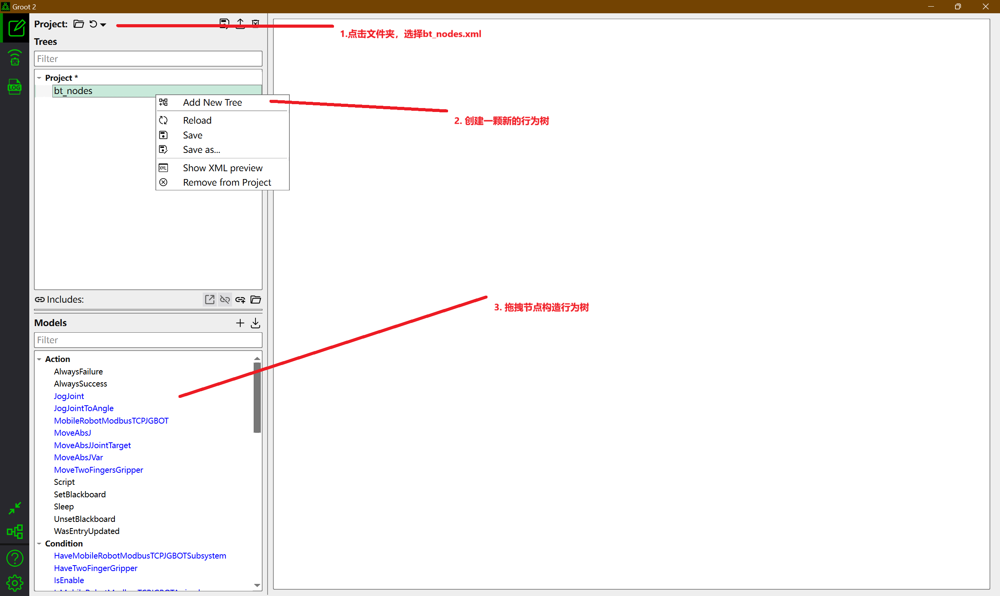
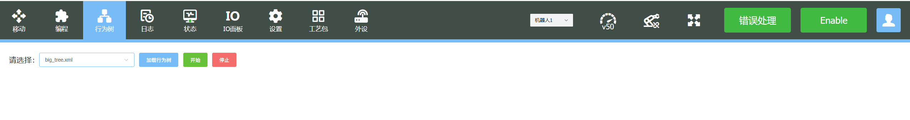

# 行为树插件使用说明

## 1. 获取xml

>  获取位于rpc_gateway/bt_trees目录下由行为树生成的bt_nodes.xml

## 2. 构造行为树

> - 在windows下打开Groot2，将bt_nodes.xml导入，随后新建行为树，
>
> 
>
> - 构建完成后保存xml文件

## 3. 运行行为树

> - 将构建好的行为树xml文件重命名为test.xml（避免命名冲突），并将其放到rpc_gateway/bt_trees，重新运行rpc_gateway
> - 打开前端界面，点击行为树界面，选择指定xml文件（test.xml），点击开始运行，即可运行刚刚构造好的行为树
>
> 

## 4. 监视行为树运行情况

> - 方式一：由于Groot2的免费版本只支持20个节点，若行为树节点少于20个，可以使用Groot2进行监视
>
> - 方式二：这里提供另一种监视方式

